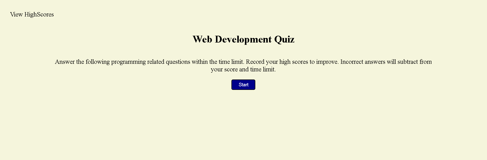

# Web-Dev-Quiz

## Description

In this project I used javascript to create a basic web development quiz in my browser.  The quiz stores your past scores in local storage to view upon different play sessions.  The game itself is multiple choice and asks the player basic javascript questions.

## Usage

The website is hosted at this link: https://smudge121.github.io/Web-Dev-Quiz/ 

To play the game, simply visit the link above and follow the button prompts to play.  To view the source code, download the code from the repository.  To add new questions or edit the current ones, simply edit the contents of the question bank variable in 'script.js'.

## Credits

1. Created by - Jaret Ishii

## License

MIT License